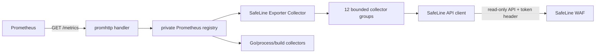

# SafeLine Exporter architecture

## Purpose

This document defines the project boundaries and the safe way to extend the exporter. It is intended for maintainers who add SafeLine API coverage, metrics, dashboards or deployment support.

The design follows the relevant conventions of Prometheus [`snmp_exporter`](https://github.com/prometheus/snmp_exporter): a small process entry point, separate configuration and protocol packages, a standard `prometheus.Collector`, and exposition through `promhttp`. SafeLine is a fixed single-target HTTP API, so SNMP-specific generators, dynamic modules, per-request targets, YAML reload and `/config` endpoints are out of scope.

## Goals

- Preserve existing `safeline_*` metric names and labels across the framework migration.
- Use the official Prometheus Go client instead of manually encoding text exposition.
- Keep SafeLine authentication and HTTP behavior isolated from aggregation logic.
- Run independent API collector groups concurrently while reporting their status separately.
- Keep labels bounded and avoid exporting request content or security-sensitive identifiers.
- Ship one repository with binary, container, Grafana and Helm assets that can be validated independently.

## Repository structure

| Path | Responsibility |
|---|---|
| `main.go` | Process version, logging, registry, HTTP routes, signals and graceful shutdown |
| `config/` | Environment/flag parsing, defaults and startup validation |
| `safeline/` | Authenticated read-only HTTP client and response-size/TLS policy |
| `collector/` | SafeLine API DTOs, aggregation and `prometheus.Collector` implementation |
| `grafana/` | Import-ready dashboards; no runtime dependency |
| `charts/safeline-exporter/` | Kubernetes Deployment, Service, Secret integration and optional ServiceMonitor |
| `METRICS.md` | Metric/API contract and cardinality decisions |
| `Makefile` | Repeatable local validation and build targets |

## Runtime flow

`/-/healthy` always returns HTTP 200 with body `ok` while the exporter process can serve HTTP. It intentionally makes no remote request and is used for both Kubernetes liveness and readiness. `safeline_up` is stricter: it is `1` only when authenticated `GET /api/open/health` returns HTTP 2xx and body status `ok`; transport, TLS, authentication, HTTP and business-status failures produce `0`. Per-collector success metrics identify failures outside the health endpoint, so Kubernetes probes do not trigger an expensive API scrape.

## Collector model

`collector.Exporter` implements `prometheus.Collector`. One Prometheus gather starts the following groups concurrently:

| Group | Main API responsibility |
|---|---|
| `health` | Remote health |
| `system` | Version and basic system state |
| `extended_system` | Architecture, edition, license and detector modes |
| `sites` | Protected applications and upstream state |
| `statistics` | Traffic, security actions, trends and QPS |
| `extended_statistics` | Security posture, clients and geography |
| `http_status` | Validated WAF/upstream status statistics |
| `events` | Normal attack events |
| `rule_events` | Blacklist/whitelist events |
| `attack_logs` | Normal detection records |
| `rule_logs` | Blacklist/whitelist records |
| `certificates` | Certificate state and expiry |

Each started group returns a snapshot. The coordinator publishes `safeline_exporter_collector_success` and `safeline_exporter_collector_duration_seconds` even when that group fails. A failure suppresses only that group's business metrics; other groups can still succeed. `safeline_exporter_scrape_success` is `1` only when all groups succeed.

Suppression applies only to the current exposition; the exporter never caches or replays the previous successful value. Prometheus applies its normal staleness behavior to an absent series. The health group is the one special case for a gather that acquires the collection gate: it always emits `safeline_up`, using `0` when transport, TLS, authentication, HTTP or health-status validation fails; `collector_success{collector="health"}` and the global scrape success are also `0` in that case.

An API envelope is valid only when it contains non-null `data` and no SafeLine `err`. An explicitly present empty array/object is successful empty data; a missing or null envelope, decode failure or missing health status is a protocol failure. If any request or page in a multi-request group fails, the whole current group result is discarded, including fetched/truncated metrics; no partial aggregate is published.

The group list and the matching result writer are registered in `collector.Exporter.Collect`. Adding a group requires adding both entries plus its success/duration coverage. `safeline.Client.Get` accepts a caller-owned response DTO through its output argument; API DTOs therefore remain beside the aggregation in `collector/`, while the client stays unaware of metric schemas.

Raw event and log APIs are paginated up to `collector.max-events`. Every such family includes fetched/truncated indicators. SafeLine's pre-aggregated values are not affected by this local limit.

All groups start concurrently. Requests within one group are sequential and each HTTP call is bounded by `safeline.timeout` (15 seconds by default). The complete gather has a shared `collector.scrape-timeout` deadline (25 seconds by default), which cancels in-flight HTTP requests. A one-slot gate serializes gathers and prevents overlapping SafeLine traffic. If a second gather reaches its own deadline before acquiring the gate, no group ran: the SafeLine exporter collector contributes only `safeline_exporter_scrape_success 0` and `safeline_exporter_scrape_duration_seconds` (including gate wait time); `safeline_up` and all per-group success/duration and business series are absent because the target was not evaluated. Independently registered Go, process, build and HTTP-handler metrics remain in the registry exposition. The standard `prometheus.Collector` interface does not carry the HTTP client's disconnect context, so the internal deadline—not client disconnect—is the hard lifecycle bound. Prometheus should use the documented 60-second interval and a timeout slightly above the exporter deadline.

## Metric rules

1. Existing metric names and label sets are compatibility contracts.
2. SafeLine rolling snapshots are gauges, not counters; dashboards must not apply `rate()` to `_window` metrics.
3. Timestamps use Unix seconds and names end in `_timestamp_seconds`.
4. Durations use seconds and names end in `_seconds`.
5. Labels may use bounded dimensions such as action, risk, module, country, protocol, HTTP method or status code.
6. Source IP values, host names from request traffic, URLs, payloads, JA4 fingerprints and request/response bodies must never become labels.
7. New collectors must expose a success signal through the coordinator and include tests for empty, error and representative data where applicable.

The fixed `24h` window applies to all `_window` metrics. At the start of a gather, the exporter records one wall-clock anchor. Event and log APIs receive `end = floor(anchor Unix milliseconds)` and `start = end − 86,400,000` through their `start`/`end` parameters; statistics APIs receive `end_time = floor(anchor Unix seconds)` and `begin_time = end_time − 86,400`, together with SafeLine's `last1Day` preset. Every group reuses the same anchor. SafeLine, not the exporter, defines whether API boundary timestamps are inclusive; the exporter neither filters boundary records locally nor deduplicates them across scrapes. Statistics APIs may also align results to hourly buckets, so their edges can differ from the anchor by one bucket. SafeLine CE 9.3.11 was observed returning the same 24 hourly buckets for other requested presets. The window flag remains for configuration compatibility and a future verified expansion, but startup currently rejects another value rather than publishing a false label. A later version may widen accepted values only after fixtures and live results prove the returned bucket range, with the compatibility table and metric documentation updated in the same change.

Configured site/domain and certificate labels are allowed because they describe a bounded operator-managed resource set. Host names observed in request traffic remain forbidden because an attacker can grow that set without an administrative configuration change.

## Configuration and secrets

Configuration remains flags plus environment variables; a YAML layer and runtime reload are unnecessary for one fixed target. The token is read from `SAFELINE_API_TOKEN` or `-safeline.token`, and the address from `SAFELINE_ADDRESS` or `-safeline.address`; an explicitly supplied flag overrides its environment default. The environment variable is strongly preferred because command-line values can be visible in process listings. `config.Config.Validate` rejects missing credentials, a metrics path that does not start with `/`, non-positive limits/timeouts and unsupported windows before the HTTP server starts.

The API token necessarily exists in process memory after configuration is loaded; its only outbound use is the `X-SLCE-API-TOKEN` request header. HTTPS with certificate verification is the default. Plain HTTP requires explicit `safeline.allow-http`, certificate verification bypass requires `safeline.insecure-skip-verify`, and redirects are never followed. The token is not logged, returned by an HTTP endpoint, exposed as a metric or stored in checked-in Helm values. Kubernetes `existingSecret` is converted to the `SAFELINE_API_TOKEN` environment variable through `secretKeyRef`; the Helm-managed Secret mode is intended for controlled cases because Helm release data then contains the token.

## Packaging

- `Dockerfile` performs a multi-stage, multi-architecture build and injects version, revision and build date.
- The scratch runtime contains only CA certificates and the static binary and runs as user/group `65532`.
- The Helm Chart applies a non-root, read-only filesystem security context and disables service-account token mounting.
- Grafana JSON is maintained once under `grafana/`. The Chart can render a runtime sidecar ConfigMap from content supplied with `--set-file`, so the JSON is not checked in twice.

## Adding API coverage

1. Confirm the endpoint is read-only and supported by the target SafeLine version.
2. Decide whether it belongs to an existing collector group; create a new group only when failure isolation requires it.
3. Define only the response fields needed for metrics.
4. Prefer SafeLine pre-aggregates. If raw records are required, use the shared 24-hour UTC epoch-millisecond bounds, `page`/`page_size` traversal, the shared `collector.max-events` limit (default 10000), and fetched/truncated metrics. Records are not replayed or deduplicated across Prometheus scrapes.
5. Add bounded metric descriptors through the collector writer and document them in `METRICS.md`.
6. Add fixture coverage and validate the complete registry through `promhttp`.
7. If the metric is operationally useful, update the Grafana dashboard without creating a second copy in the Chart.
8. Run `make check`, `make test-race`, `make helm-lint` and a container build before release.

The supported SafeLine version set is exactly the versions listed in the compatibility table; currently that is CE 9.3.11 only. All registered calls are required on that baseline and therefore participate in group and global scrape success. A new endpoint may become a required call only after fixtures and a live check verify it on every listed supported version. There is no optional or capability-gated collection path today: HTTP 404, API errors and missing data are failures, never silent skips. If future multi-version support needs optional coverage, that change must first define a stable version/capability signal, a bounded `supported` metric, and skip/failure semantics in this document; until then, defer an endpoint that is absent on any supported version. Adding an unconditional failing call or group is a breaking behavior change.

Metric names, types, units, calculation semantics, label names/value meanings, conditional-series rules and collector names are compatibility contracts. If an unavoidable correction requires a replacement, add a new metric, document the old one as deprecated for at least one release, update dashboards, and remove it only in a clearly identified breaking release. Before version 1.0 a breaking change requires a minor-version bump; after 1.0 it requires a major-version bump.

## Tested compatibility

| Component | Verified behavior |
|---|---|
| SafeLine CE 9.3.11 | All 12 collector groups and fixed 24-hour statistics window |
| Go 1.23+ | Build target declared by `go.mod` and the build container |
| Prometheus client_golang 1.23.2 | Registry, exposition and runtime collectors |
| Grafana 10.4+ | Dashboard schema and datasource variables |
| Helm 3.21 | Chart lint and template rendering |

## Deliberate differences from snmp_exporter

- One SafeLine target is configured at startup; `/metrics` performs the scrape directly.
- No per-request `target`, `auth` or module query parameters are accepted.
- No generator is needed because the SafeLine API schema is finite and explicitly modeled.
- No configuration display/reload endpoint is provided, preventing accidental credential exposure.
- Dashboard and Helm assets live in simple repository directories rather than adopting the SNMP mixin and generator toolchain.
